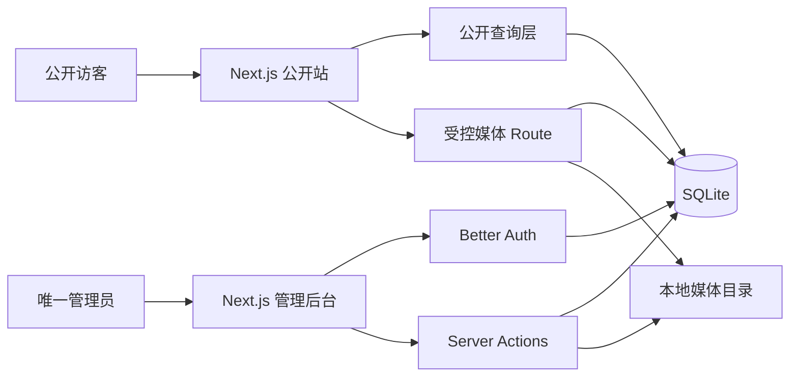

# 架构说明

## 总览

SciLab Web 是单包、单进程的 Next.js 全栈应用。公开站、管理后台、认证、内容查询和 SQLite 写入均由同一个 Node.js 进程处理，适合单个实验室或小型科研团队在一台 VPS 上运行。



## 主要目录

```text
src/app/(site)       公开页面与详情路由
src/app/admin        登录和管理后台页面
src/app/api          认证、健康检查、媒体 HTTP 入口
src/components       公开站、后台和 UI 组件
src/server/actions   后台写操作、校验、事务和缓存失效
src/server/auth      Better Auth、会话与 Origin 防护
src/server/db        Drizzle schema、SQLite 客户端和 migration
src/server/services  公开查询与媒体服务
drizzle              已提交的生产 SQL migration
scripts              migration、seed、管理员和备份 CLI
ops                  面向小白的一键 Docker 运维脚本
tests                 单元、集成与 Playwright 测试
```

## 数据模型

- 认证：`user`、`account`、`session`、`verification`。数据库触发器限制只存在一个管理员。
- 站点：单例 `site_settings` 与固定 `pages`（about/join/contact）。
- 内容：`members`、`research_areas`、`projects`、`publications`、`news_posts`。
- 关联：项目—成员/研究方向，成果—成员/项目/研究方向使用显式连接表。
- 媒体：`media_assets` 保存元数据和哈希，文件位于 `UPLOAD_DIR`。
- 审计：`audit_logs` 记录登录外的主要内容写操作，不保存密码、token 或正文快照。

内容状态只有 `draft` 与 `published`。公开查询层永远附加 `published` 条件，关联内容也再次过滤；后台不能只依赖 layout 重定向，每个页面和写入口都会在数据访问前验证会话。

## 请求与写入

- 公开页面采用 Server Components，直接调用只读服务，不提供公共 JSON 内容 API。
- 后台表单使用 Server Actions；项目和成果的主记录、连接表与审计日志在同一 SQLite 事务中提交。
- 登录通过 Better Auth HTTP handler，以便统一执行 Origin 检查和登录限流。
- 通用 Better Auth 账户修改 HTTP 端点被禁用；改名、改邮箱和改密只能经过带审计的后台入口，其中改密会撤销全部会话。
- 上传和删除是自定义 Route Handler，会同时验证管理员会话与请求 Origin。
- 富文本存储为受限 Tiptap JSON；写入时验证节点/链接/图片，输出时再生成并净化 HTML。

## 媒体可见性

媒体 ID 不等于公开权限。读取媒体时先检查它是否被当前已发布内容、站点 Logo 或 Hero 引用：

- 已发布引用：允许匿名读取，带 ETag 且每次缓存使用前重新验证可见性；
- 仅草稿引用或未引用：只有管理员会话可读取，响应为 `private, no-store`；
- 不存在或无权：统一返回 404，避免枚举。

图片在写盘前校验 magic bytes、限制大小，并通过 Sharp 自动旋转、缩放和重编码为 WebP。PDF 强制下载并使用流式响应，避免把大文件整体放入 Node.js 堆。

公开媒体不经过 Next 图片优化器的长期衍生缓存，而是直接请求受控媒体路由。这样内容取消发布后，原图和页面中的图片 URL 会同时重新判权并返回 404，不会继续暴露曾经公开的缓存副本。

## 缓存与失效

公开列表和详情使用 Next 数据缓存与实体 tag。写操作完成后按 `site-settings/pages/members/research-areas/projects/publications/news` 失效，并刷新相关路径。详情进入缓存前先用有限的已发布 slug 索引过滤，未知随机 slug 不创建无界缓存项。

## SQLite 约束

连接启用 `foreign_keys=ON`、WAL、5 秒 busy timeout。生产只允许运行一个应用实例并使用 VPS 本地磁盘；NFS、多副本共享文件或 Serverless/Edge 均不受支持。需要横向扩展时，应先迁移到 PostgreSQL 并重新评估事务、认证 adapter 和媒体存储。
